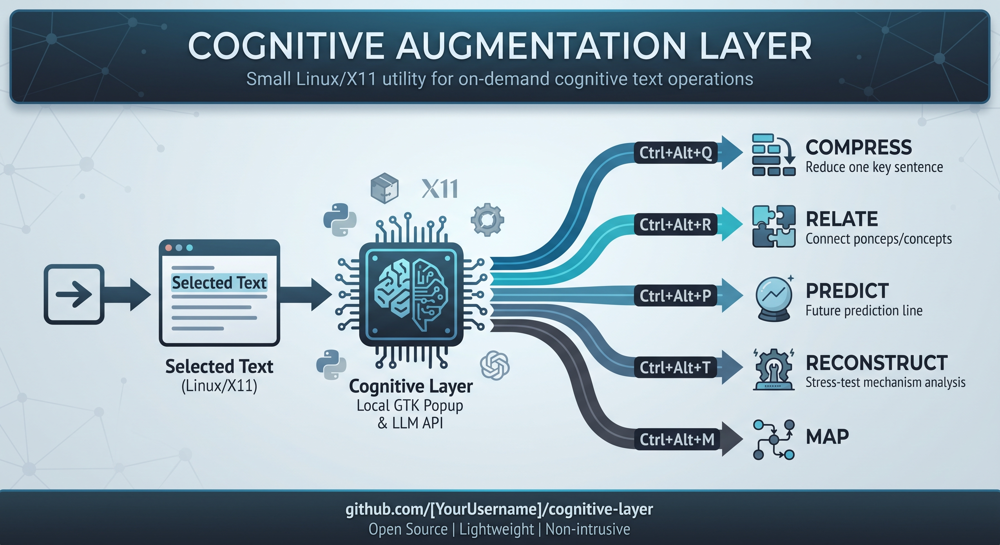

# Cognitive Augmentation Layer



Small Linux/X11 utility for running a few cognitive operations on whatever text is currently selected or copied.

The first version is intentionally small:

- global `Ctrl+Alt+Q/R/P/T/M` hotkeys;
- PRIMARY selection first, clipboard second;
- one OpenAI-compatible chat-completions endpoint configured through environment variables;
- fixed prompts per operation;
- GTK popup next to the pointer;
- Enter copies the result, Esc closes it;
- user-level systemd autostart;
- lightweight local event logging.

The implementation follows the working model described in [THEORY.md](THEORY.md): compression, relation-building, prediction, reconstruction, and mapping are treated as small cognitive actions rather than as a separate study environment. The theory document contains the full architectural rationale, prompt examples, MVP boundaries, and formal cognitive foundation.

## Attribution and reuse

This project is based on the original idea and methodology developed by Justin Sung and on the practical implementation work by the project author. If someone wants to reuse, adapt, or extend this project, they must acknowledge the following:

- the project author as the original implementer of this code and tooling;
- Justin Sung as the original methodological source and conceptual foundation of the cognitive workflow;
- the underlying methodological lineage developed by Justin Sung, from which this work derives.

In other words: reuse is allowed, but attribution is required. The project should not be presented as a fresh, standalone invention without citing the original authorship and conceptual source.

## Operations

| Hotkey | Operation | Purpose |
|---|---|---|
| `Ctrl+Alt+Q` | `COMPRESS` | Reduce selected text to a core claim / invariant. |
| `Ctrl+Alt+R` | `RELATE` | Identify the strongest meaningful relation between concepts. |
| `Ctrl+Alt+P` | `PREDICT` | Generate a prediction before reading further. |
| `Ctrl+Alt+T` | `RECONSTRUCT` | Generate a mechanism-level stress-test question. |
| `Ctrl+Alt+M` | `MAP` | Build a compact nodes + relations structure. |

## Dependencies (Arch)

```bash
sudo pacman -S --needed python-xlib python-gobject gtk3 xclip xdotool
```

## Install

```bash
mkdir -p ~/projects/cognitive-layer
cp cognitive_daemon.py cognitive_popup.py cognitive_trigger.sh cognitive-tools.service ~/projects/cognitive-layer/
cd ~/projects/cognitive-layer
chmod +x cognitive_daemon.py cognitive_popup.py cognitive_trigger.sh
```

Install the user service:

```bash
mkdir -p ~/.config/systemd/user
cp cognitive-tools.service ~/.config/systemd/user/
systemctl --user daemon-reload
systemctl --user enable --now cognitive-tools.service
systemctl --user status cognitive-tools.service
```

The service assumes the default path `~/projects/cognitive-layer`. Change `ExecStart` in the unit if you install elsewhere.

## LLM endpoint

The client expects an OpenAI-compatible `POST /chat/completions` shape.

```ini
Environment=COGNITIVE_API_URL=http://127.0.0.1:8081/v1/chat/completions
Environment=COGNITIVE_API_KEY=
Environment=COGNITIVE_MODEL=gemini-flash-lite
Environment=COGNITIVE_TIMEOUT=12
Environment=COGNITIVE_RETRIES=3
```

This can point at a local model server or a remote gateway. The default implementation does not hard-code a provider.

## CLI trigger

The same operations can be called without the resident hotkey daemon:

```bash
./cognitive_trigger.sh compress
./cognitive_trigger.sh relate
./cognitive_trigger.sh predict
./cognitive_trigger.sh reconstruct
./cognitive_trigger.sh map
```

The trigger reads X11 PRIMARY selection first and falls back to the normal clipboard. The text is passed as a process argument rather than interpolated into a shell heredoc.

## Relation to the Study Engine

This layer is the interaction-side augmentation for the Study Engine, not a replacement for it.

The separation is intentional:

```text
Study Engine
  durable study state / topics / sessions / revision / assessment
             ^
             |
      cognitive actions
             |
Cognitive Layer
  compress / relate / predict / reconstruct / map
             ^
             |
      selected/copied text
             ^
             |
      any desktop application
```

The Cognitive Layer should stay stateless by default. Its job is to make the next useful cognitive action cheap enough to happen in the middle of normal reading. The Study Engine can remain the place where durable learning state is stored and assessed.

A later integration can let the Study Engine provide context or receive successful reconstruction results, but the first version deliberately does not require a specific Study Engine API.

## Notes

This project is currently X11-oriented. Wayland/global-hotkey support is intentionally not part of the first version.

Prompt text lives in `cognitive_daemon.py` for now because the goal of this version is fast iteration rather than a configuration framework.
